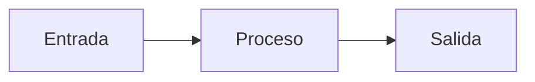

# danilobustos.com — instrucciones para agentes de código

Este archivo existe para que Claude Code, OpenCode, Codex o cualquier otro
agente pueda generar y editar contenido y código de este sitio sin que haya
que reinstruirlo cada vez. Léelo entero antes de tocar nada.

## 1. Qué es este sitio

El sitio personal de Danilo Bustos. **Es una plataforma de escritura, no un
portafolio.** A nivel staff se asume que sabes construir; lo que se evalúa es
el criterio, y el criterio se demuestra escribiendo. Objetivo secundario: que
la gente lo visite por voluntad propia, no solo cuando busca su nombre.

- Stack: Astro (estático), Markdown/MDX, Vercel. Node 22+.
- Dominio: `danilobustos.com`. El dominio es el nombre; sin marcas inventadas.
- Idioma de la interfaz: inglés. Un ensayo puede estar en español (`lang: es`).
  Un ensayo se escribe en un solo idioma, nunca en los dos: no hay traducciones,
  ni rutas por locale, ni `hreflang`, ni selector. Lo elige la audiencia de ese
  texto concreto. En el índice, el ensayo que no está en el idioma del sitio
  lleva una marca discreta (`ES`).
- Comandos: `npm run dev` (local), `npm run build` (check + build), `npm run preview`.

## 2. Dónde vive cada cosa

```
src/config/site.ts          identidad: nombre, URL, enlaces, navegación, copy de la home
src/content.config.ts       esquema del frontmatter (la fuente de verdad)
src/content/writing/        los ensayos, uno por archivo; el nombre es el slug
src/content/writing/_plantilla.md   plantilla para copiar
src/content/pages/          cuerpo de /about, /now y /resume
src/lib/categories.ts       las tres categorías y su audiencia
src/lib/posts.ts            consultas: orden, borradores, destacados
src/lib/resume.ts           la trayectoria, como datos; alimenta el timeline de /resume
src/styles/global.css       sistema de diseño: tokens, tipografía, prosa
src/layouts/, src/components/, src/pages/   el sitio
src/pages/lab/              páginas de trabajo (tipografía, acento, prosa); desechables
src/assets/og/              fuentes TTF solo para las imágenes Open Graph
.claude/skills/publish-post/    skill para publicar un ensayo
scripts/new-post.mjs        crea el archivo de un ensayo con el frontmatter correcto
```

## 3. Cómo publicar un ensayo

Usa la skill `publish-post` (o `node scripts/new-post.mjs`). Lo esencial:

**Slug y URL.** El nombre del archivo es la URL permanente: `/writing/<slug>`.
Solo minúsculas, dígitos y guiones. Sin fechas, sin categorías, sin acentos
(`ñ` → `n`). El slug va en el idioma del ensayo: `eleven-years-at-equifax.md`
para uno en inglés, `de-puerto-natales-a-google.md` para uno en español. El
build rechaza slugs
inválidos y los que chocan con rutas del sitio (`about`, `now`, `resume`,
`writing`, `lab`, `og`, `rss`, `default`, `index` y los nombres de las
categorías). Un slug publicado no se cambia nunca.

**Frontmatter.** Exactamente estos campos (definidos en `src/content.config.ts`):

```yaml
---
title: 'Título del ensayo'            # obligatorio, ≤ 120 caracteres
description: 'Una o dos frases.'      # obligatorio, ≤ 220; va a LinkedIn, Google y RSS
date: 2026-10-13                      # obligatorio, YYYY-MM-DD
updated: 2026-11-02                   # opcional, solo tras una revisión sustancial
category: notes                       # obligatorio: engineering | enterprise | notes
featured: false                       # true = sale en la portada; el índice no lo distingue
draft: true                           # true = visible en dev, ausente en producción
lang: en                              # en | es; por defecto en
origin:                               # opcional: versión previa publicada en otro sitio
  label: 'LinkedIn'
  url: 'https://www.linkedin.com/...'
---
```

**Destacados.** Se marcan con `featured: true`, nunca a mano en el código.
Mantén tres o cuatro. Para rotar, cambia el campo en dos archivos.

El campo hace **una sola cosa**: decidir qué sale en la portada. El índice de
`/writing` lista todo por fecha y no distingue destacados; si los repitiera,
ir de la home al índice no enseñaría nada nuevo. La home promociona, el índice
lista. En la portada, además, el destacado más reciente es el que se lleva el
titular grande —eso tampoco se configura: sale del orden por fecha.

**Borradores.** `draft: true` existe en `npm run dev` y no existe en el
build. Para publicar: `draft: false`, fecha real, `npm run build` en verde.

**Categorías.** Una sola por ensayo. Ver sección 5.

## 4. Voz y flujo de escritura (regla de oro)

**Claude no redacta prosa de cero.** El flujo validado es:

1. Claude hace preguntas de entrevista (andamiaje, estructura, estrategia).
2. Danilo dicta las respuestas en bruto, en su voz.
3. Claude aplica corrección de mecánica solamente.

Por qué: un texto anterior se verificó contra Pangram (detección de texto
generado por IA). Las secciones redactadas por Claude fueron marcadas como
IA aunque imitaran el registro de Danilo; las que Danilo dictó pasaron
limpias. Cuanto más escrutinio público tiene un texto, más necesario es
que las oraciones sean suyas.

El contrato: Claude aporta estructura, estrategia, corrección ligera y
andamiaje de entrevista. Danilo aporta toda la prosa. Un borrador nuevo se
crea con las preguntas de entrevista como cuerpo (ver los borradores en
`src/content/writing/`).

**Esto cubre también el copy del sitio, no solo los ensayos.** Son prosa de
Danilo y se dictan igual: `domains`, `tagline`, `shortBio` y `now` en
`src/config/site.ts`, el cuerpo de `src/content/pages/` y la descripción del
índice de `/writing`. La microcopia de interfaz (navegación, encabezados de
sección, estados vacíos, 404) no lo es: ésa Claude la escribe y la traduce.

### Marcadores de voz que se PRESERVAN (no son errores)

- "can not" en dos palabras.
- Comma splices.
- Oraciones largas y acumulativas con punto y coma.
- Artículos definidos donde el inglés estándar los omite ("the governance", "the taste").
- Sustantivos de dominio capitalizados (Agents, Users, Production).
- "very important" como intensificador propio.
- El giro X-no-Y ("the goal is not…, the goal is…").
- Apartes entre paréntesis, incluidos los honestos ("(I can not disclose them)").
- Decisiones ya zanjadas y deliberadas: "worth to build", "how good is your
  factory", "takes tremendous relevancy", "is because" tras "one of the reasons".

### Errores que SÍ se corrigen

- Sujetos omitidos por transferencia del español ("because applies" → "because it applies").
- Falsos amigos ("bespoken" → "bespoke", "instrumentalize" → "instrument").
- Desajustes de concordancia verbal.
- Palabras duplicadas.
- Faltas de ortografía por interferencia del español.
- Palabras que no son inglés natural ("adrenalinic" → "fast-moving").

### Tono declarado

Lenguaje simple. Genuino y motivador. Mostrar, no explicar ("it belongs to
my team" en vez de explicar por qué). Cierres con energía y confianza, sin
sobreexplicar.

### La skill de voz

Existe una skill completa, `danilo-voice-editor`, construida durante el
artículo de LinkedIn "From AI Foundations to Agentic Factory: my key
learnings". Vive en la máquina de Danilo:

    /Users/danilobustos/personal/ai/skills/danilo-voice-editor/SKILL.md

Si está disponible, úsala: es la fuente de verdad sobre la voz. Para usarla
desde este repositorio, copiarla a `.claude/skills/danilo-voice-editor/SKILL.md`
(decisión de Danilo si se versiona o se mantiene local). Las reglas de arriba
son el resumen mínimo por si no está.

## 5. Las tres categorías

Un solo blog con tres categorías visibles. La audiencia es deliberadamente
mixta; las categorías permiten servir a ambas sin diluir el sitio.

| Categoría | Audiencia | Tono y alcance |
| --- | --- | --- |
| `engineering` | Ingenieros a los que quiere influenciar. | Cómo se construyen de verdad los sistemas. Decisiones bajo restricciones, con detalle técnico y diagramas. Normalmente inglés. |
| `enterprise` | Líderes y decisores del enterprise tradicional (nivel CIO). | Estrategia y adopción de IA. Sin jerga innecesaria; el criterio, no la implementación. Normalmente inglés. |
| `notes` | Amigos, familia y quien quiera leer. | Escritura personal genuina: vida y aprendizajes fuera de lo técnico. Nunca consejos de carrera genéricos. Material propio: Patagonia / Puerto Natales, Atlanta. Español cuando el texto va a ese círculo. |

El id de la categoría es la URL del índice (`/writing/engineering`). No forma
parte de la URL de un post.

Distribución (para el copy de cierre y las llamadas a la acción): Ingeniería
y Enterprise se comparten en LinkedIn y X; Notas en Facebook e Instagram.
Esas dos redes NO se enlazan desde el sitio.

## 6. Guardarraíles de divulgación (aplican a TODO lo que se publique)

- Sin nombres internos de sistemas o productos, salvo que ya sean públicos
  en posts de ejecutivos.
- Sin cifras en dólares más allá de las públicamente confirmadas.
- Las afirmaciones de hito (tipo "primeros Agents en Producción") requieren
  confirmación contra declaraciones públicas.
- La crítica a proveedores va anónima; el agradecimiento puede nombrarlos.
- Las ideas de liderazgo se atribuyen con el encuadre "idea del post de X",
  no con cita textual, salvo que la redacción exacta esté verificada.

## 7. Diagramas

**Los diagramas son texto, no imágenes.** Por defecto, Mermaid dentro del
Markdown:

````markdown

````

Se renderizan solos en el navegador, con los colores del sitio en modo
claro y oscuro; sin JavaScript queda el código a la vista. Úsalos cuando
un flujo o una arquitectura se explique peor en prosa; no como adorno.

Escalera si Mermaid se queda corto: Mermaid → Excalidraw (aspecto dibujado a
mano, vía `@excalidraw/mermaid-to-excalidraw`, solo flowcharts), D2 para
diagramas más complejos, Excalidraw a mano solo para algo a medida. No
resolver el problema antes de tenerlo.

## 8. Formato por plataforma

**Este blog** es la copia canónica: aquí sí hay Markdown, desarrollo largo
y diagramas. LinkedIn premia la brevedad; el blog premia el desarrollo.
Al migrar un texto desde LinkedIn no se copia y pega: se reescribe más
largo, con más profundidad y contexto, y se enlaza el original en `origin`.

**LinkedIn (feed):** cero Markdown, una idea por línea, línea en blanco entre
bloques, contención con emoji, listas como guiones o flechas, 3 a 5 hashtags
al final (uno amplio + nichos), cierre con una sola pregunta corta y
respondible. Ventana: martes o miércoles, 9:30 a 10:30 AM ET; bloquear la
hora siguiente para responder comentarios.

**Cross-posting:** LinkedIn primero; el resto una semana después. Medium
solo con su herramienta de importación, para que el canonical apunte aquí.
Dev.to, descartado.

**Newsletter (Substack).** Decisión revisada: Substack estaba descartado como
sitio donde *publicar*, y eso no cambia — la copia canónica es este blog y el
canonical apunta aquí. Lo que sí existe es Substack como lista de correo: un
canal propio, sin algoritmo de por medio, para avisar de un ensayo nuevo.

Cómo se enlaza, y esto no se negocia: **un enlace hacia fuera, nunca un
formulario.** La captura del correo ocurre en Substack, no en el sitio, así
que §9 sigue intacto. Vive en `SITE.newsletter` (`src/config/site.ts`); vacío
significa que no se muestra en ninguna parte, igual que `social.twitter` y
`email`. Cuando tenga URL aparece en el pie y al final de cada ensayo, en el
idioma del ensayo (`ui()` en `src/lib/i18n.ts`).

RSS se queda y no compite con esto: sirve a los lectores de feeds, no es un
canal de distribución por sí solo.

## 9. Diseño: lo que no se rompe

- Editorial, tipo revista. Muchísimo espacio en blanco.
- **Sin sombras y sin cajas. Nada encierra al contenido.** Jerarquía con
  tamaño y espacio; el color no la hace nunca.

  Lo que sí se permite es un **pelo de `--rule` que estructura sin encerrar**,
  y hay exactamente dos: la regla bajo la cabecera y el filete vertical de la
  línea de tiempo en `/resume` (con un punto por organización, en `--muted`).
  Los dos usan el mismo token que `hr` y las tablas.

  La prueba antes de añadir un tercero: **¿rodea algo?** Si el trazo cierra
  un perímetro —una tarjeta, un recuadro, un aviso— no va. Si es una sola
  línea que marca un eje o separa dos zonas, se puede discutir. Y sombras,
  fondos de color y bordes redondeados sobre bloques no entran nunca.
- Un único color de acento (`--accent`), solo para enlaces. Los del menú lo
  son: van en acento y subrayados, no apagados.
- **La cabecera es la misma en todas las páginas**: nombre, línea de
  territorio (`SITE.domains`), navegación y retrato. Por eso la home no lleva
  encabezado propio y `/resume` no repite el nombre — sería duplicarlo justo
  debajo. El retrato vive en `src/assets/avatar.{jpg,png,webp}`; si el archivo
  no está, la cabecera se dibuja sin él y no hay que tocar código.
- Tipografía: `--font-heading` (Newsreader) y `--font-body` (Inter). Cambiar
  la fuente es cambiar la variable en `src/styles/global.css`.
- Modo claro y oscuro; todo par texto/fondo por encima de AA.
- Sin animaciones decorativas. Sin pop-ups ni captura de correos: el
  newsletter es un enlace de texto hacia Substack, nunca un formulario
  embebido ni una caja (ver §8).
- `/lab` es desechable: cuando haya decisión de fuente y acento, borrar la
  carpeta y las familias "laboratorio" de `astro.config.mjs` y `package.json`.

## 10. Código y commits

- Antes de dar algo por hecho: `npm run build` en verde.
- Commits pequeños y significativos, con un mensaje que explique el
  **porqué**, no solo el qué. El historial es público y visitable desde el
  sitio; es parte de la credibilidad técnica.
- No editar `dist/` ni `.astro/`: se generan.
- Sin dependencias nuevas que no se justifiquen en una línea.
