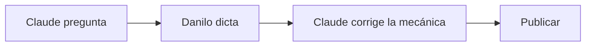

Este es un párrafo de muestra para ver cómo se comporta la columna de lectura. La medida está pensada para unos sesenta y cinco a setenta y cinco caracteres por línea, que es donde el ojo vuelve al margen sin esfuerzo. Un *énfasis en itálica*, un **peso en negrita**, y un [enlace dentro del texto](#) que usa el único color de acento del sitio.

## Un título de segundo nivel

A nivel junior hay que probar que sabes construir, por eso se muestran artefactos. A nivel staff eso ya se asume; lo que se evalúa es el criterio: cómo piensas y cómo decides bajo restricciones. El criterio no se demuestra con capturas de pantalla, se demuestra escribiendo.

> El sitio deja de ser un documento de postulación y pasa a ser algo que la gente visita por voluntad propia.

### Un título de tercer nivel

- Primer punto de una lista, corto.
- Segundo punto, algo más largo, para ver cómo se parte la línea cuando el texto ocupa más de una y vuelve al margen.
- Tercer punto con `código en línea` dentro.

1. Un paso.
2. Otro paso.
3. El último.

```ts
// Un bloque de código con el tema dual de Shiki.
export async function getFeaturedPosts(limit = 4): Promise<Post[]> {
  const posts = await getPosts();
  return posts.filter((post) => post.data.featured).slice(0, limit);
}
```

| Opción | Aspecto | Generable por agente |
| --- | --- | --- |
| Mermaid | Genérico | Sí |
| Mermaid → Excalidraw | Dibujado a mano | Sí (solo flowcharts) |
| D2 | Elegante | Sí |
| Excalidraw a mano | A medida | No |

---



Un último párrafo después del diagrama, para comprobar el espacio que queda alrededor.
